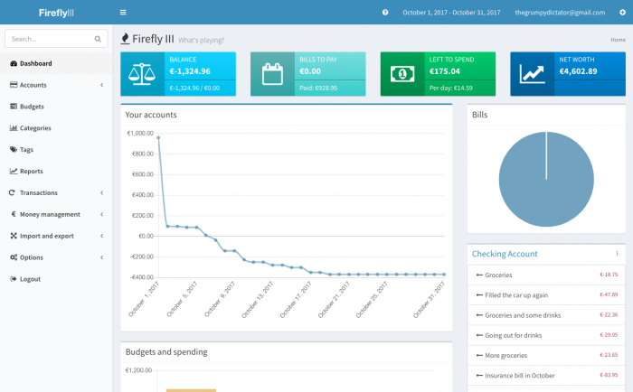
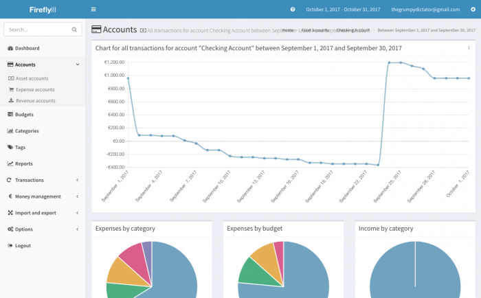
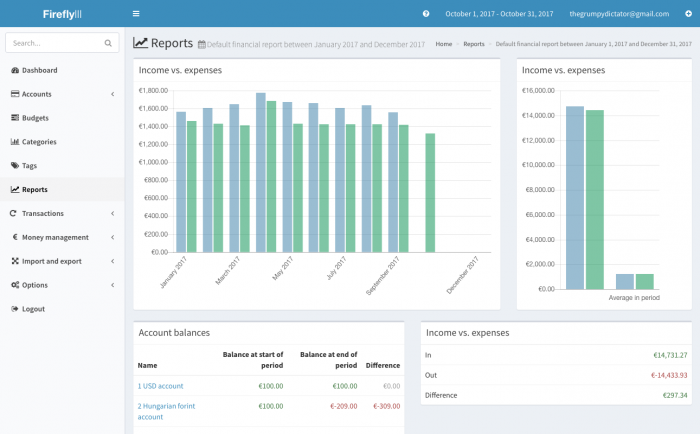
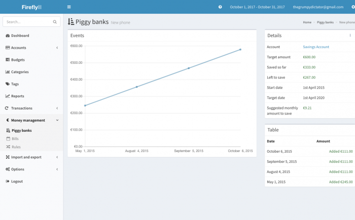

Please note that everything in these screenshots is fictional and may not be realistic. You can click on the screenshots for a larger view.

This shows you the index of Firefly III:

This is a typical account overview in Firefly III:

This is what the budget-overview looks like in Firefly III:

The default financial report can tell you everything you need to know:

A piggy bank is a typical thing to manage: try saving a large amount and you know how difficult it can be. But with Firefly III, not anymore:

