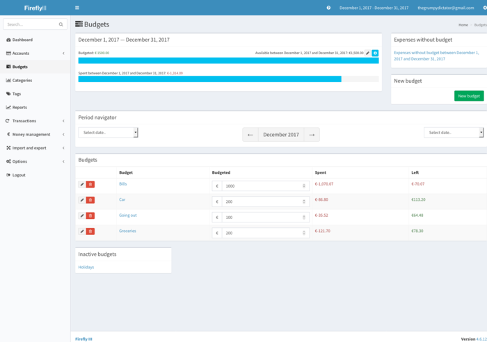
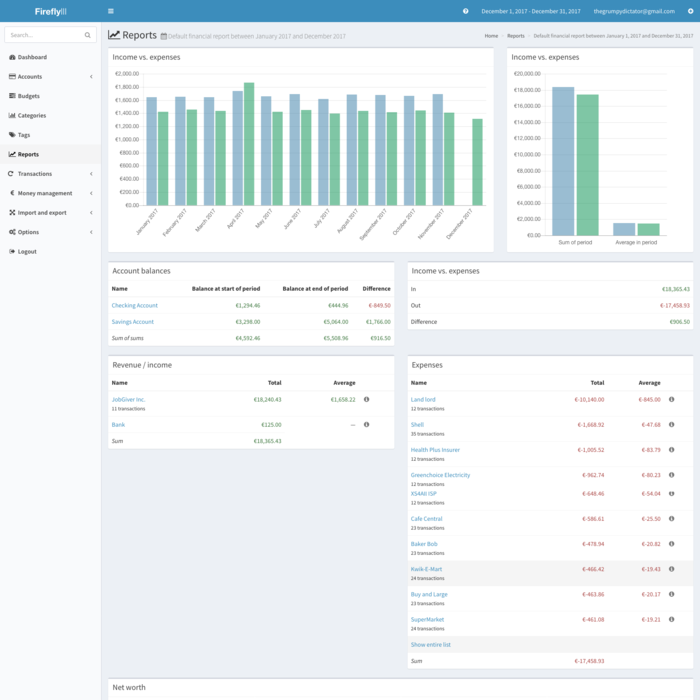
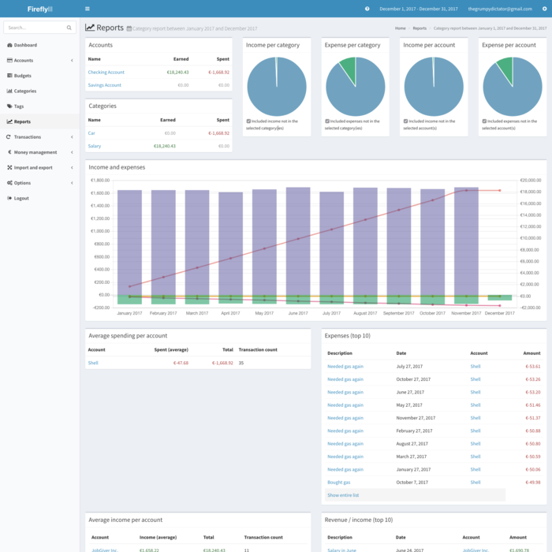

Please note that everything in these screenshots is fictional and may not be realistic. You can click on the screenshots for a larger view.

This shows you the index of Firefly III:

This is a typical account overview in Firefly III:

This is what the budget-overview looks like in Firefly III:

This is what a category looks like in Firefly III:

The default financial report can tell you everything you need to know about your financesL

And if you need to, a category report can give you even more insights.

